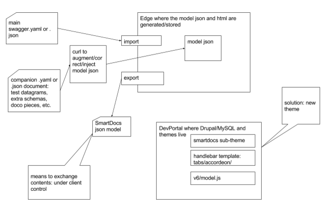

# smartdocs-services
The REST API services module for key functionality to enable CI/CD for swagger-devportal workflow.

The project is a distributed hackaton amongst YL, DC, and GK to come up with a PoC 
for swagger-based CI set of processes. 

Right now we are dealing with a mix of problems that deny smooth out-of-the-box 
experince.

Amongst them:
- bugs in swagger import process (default number type values is not passed
 to a smartdocs json model, Edge java code)

- bugs in SmartDocs rendered theme (model.js; default values are not rendered
 in a sample datagram, /v6/model.js in drupal theme)

- Current DevPortal/SmartDoc solution is flowed and neglected. However, 
the principle and components are right and all the correct moving parts are in place.

As the ultimate goal is a Look & Feel, we can augment current process 
to overcome its implementation limitations.

Deliverables:

* process for off-side development; 
* on-site update; (ie, 'curl'-based script)
* expose render/publish interface for smardocs via drupal rest module
* new advanced to out-of-the-box sub-theme better fitted for real life
* swagger-driven CI workflow

Features of an alternative Apigee out-of-the-box Theme:
- api page: amadeus left side https://sandbox.amadeus.com/travel-innovation-sandbox/apis/get/location/%7Bcode%7D

- api page: payeasy center and right sides
http://dev-payeezy.devportal.apigee.com/payeezy-api/apis/post/transactions-11

- more options for advanced branding customization; 
http://docs.apigee.com/developer-services/content/using-smartdocs-document-apis

---

## Tasks

### drupal services-related functionality
[x] post action/drupal services module
[x] form file field]\
[x] form actions

### programmatic execution of click sequence
[ ] create model\
[x] import swagger file\
[x] render and publish
[ ] REFACTOR: into model/controller, functions
[ ] REFACTOR: pipe file object from import to render function

### drupal module distribution
[x] add 'import swagger specification' permission \
[ ] _install hook. do we need it? \
[x] wrap it up as an drupal module 

## Quick setup guide
[ ] User access documentation

[x] Test against pantheon devportal instance

1. Install and enable Services drupal module and REST server\
drush dl services\
drush en services\
drush en rest_server\

1. copy smartdocs_service folder into /var/www/html/sites/all/modules
1. Refresh and switch on SmartDocs service module.

1. Configure endpoint
    * Structure/Services
        1. Edit tab. Add service \
            Machine-readable name of the endpoint: devportal
            Server: REST
            Path to endpoint: devportal
        1. Resources. Select Smartdocs/Actions/render
1. Run request \
http://192.168.56.102/devportal/smartdocs/render?name=yyy
1. Look at the Report/Recent Log Messages for the watchdog() output
1. Look at the /var/log/httpd for server and devportal errors (including php syntax errors)

NOTE: make sure your Endpoint Authenticated User can connect (Configuration/DevPortal)

---
## Links

### Default Values fix: 
https://community.apigee.com/articles/26982/smartdocs-default-values-from-request-body-schema.html

### DC's trilogy on Drupal services module operations and security/authentication
https://www.dinochiesa.net/?p=1297\
https://www.dinochiesa.net/?p=1331\
https://www.dinochiesa.net/?p=1345\

