# How to install and use smartdocs-services module

Prerequisites

- pantheon dashboard for on-cloud DevPortal instances

- devportal site

- pantheon administrator identity

- devportal administrator identity

- services and rest-server modules [are part of your devportal instance, but should be enabled]

## Configuring Services Module

### Enabling the Services and REST Server modules

As a DevPortal administrator, 

1. Go to the Modules list.

1. Locate Services module and turn it on. 

    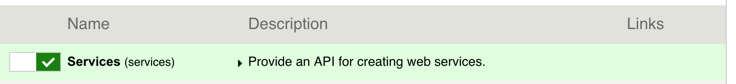

1. Locate REST Server module and turn it on.

    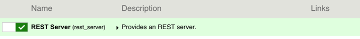

1. Save Configuration.

### Configuring Server

1. Go to Structure/Services

1. Click on Add button.
    
    Fill the attributes of the new endpoint

	Machine-readable name of the endpoint: devportal

	Server: REST

	Path to endpoint: devportal

    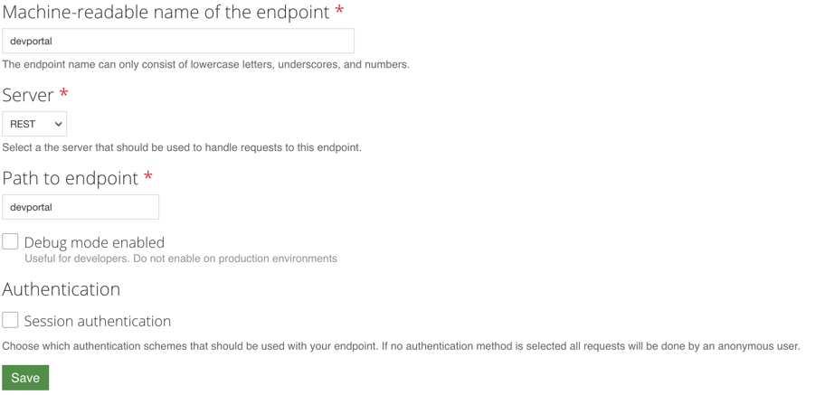

1. Save the endpoint definition.

### Test the devportal Endpoint

1. Click on Edit Resources link.

1. Unfold node Resource (click on right arrow) and select retrieve operation.

1. Press Save.

1. In a browser, navigate to the [http://dev-<site>.devportal.apigee.com/devportal/node/1](http://dev-seandavis.devportal.apigee.com/devportal/node/1) address. Load the page. 

    You should see now the XML representation of the node 1 contents. 

### Switch on Authentication for the Services Module

1. In the dev-<site> Services page, select Edit tab of the devportal endpoint.

1. Check Session authentication check box.

    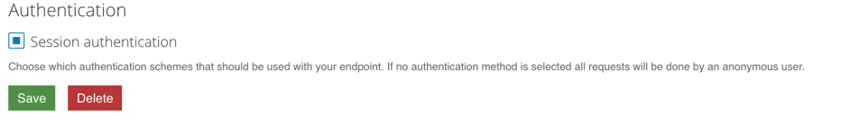

    Save.

1. In the Resource Tab of the devportal endpoint, check login, logout, and token actions of the user resource. 

1. Save.

## Install Smartdocs-Services Module. Pantheon

As a Pantheon Administrator, 

1. Clone the DevPortal site git repository, using git command from the Code tab.

    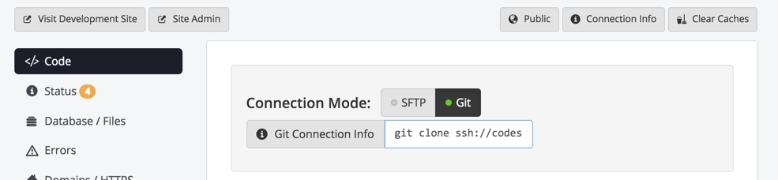

1. Clone [https://github.com/yuriylesyuk/smartdocs-services](https://github.com/yuriylesyuk/smartdocs-services) project.

1. Copy src/smartdocs_service directory from smartdocs-services project to the project of your DevPortal site at  <dev-portal-git-cloned-repo>/sites/all/modules.

    **NOTE:** For On-Premises installations, the path to the location of the smartdocs-services module directory will be /var/www/html/sites/all/modules
1. Commit and push the module.

    ```
    git add .

    git commit -m 'Adding SmartDocs Services module.'

    git push
    ```

### Switch the SmartDocs Services module on

As a DevPortal side administrator, 

1. Go to Modules

1.  Locate Smartdocs Service module.

1.  Enable it.

1. Save the configuration.

    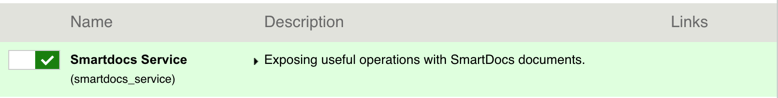

### Enable smartdocs Services on the devportal Endpoint

1. Go to Structure/Services. 

1. Click on Edit Resource link of the devportal Service.

1. On the Resources tab, check the checkbox next to the smartdocs resources for import action.

    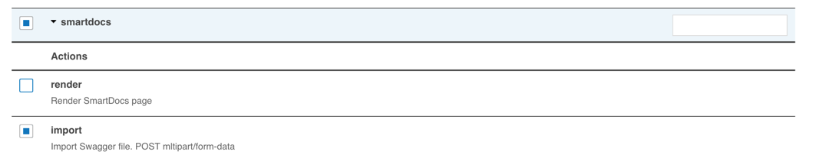

1. Save the changes.

### Setting up Permissions for the SmartDocs Service Actions

1. Go to People/Permissions

1. In the Smartdocs Service section make sure that authenticated user is allowed to perform the Import Swagger specification operation.

    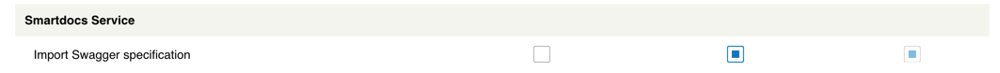

1. Save permissions.

## Import Operation of the Smartdocs Service Module

### Create the Model

1. Go to Content/SmartDocs

1. Click on New model link.

1. Enter name field value: Banking

1. Click on Create Model button.

    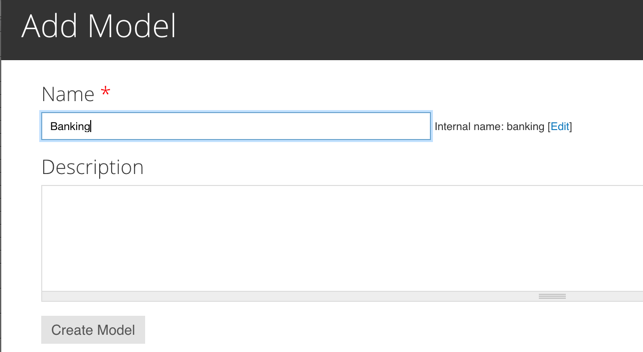

    The message Banking was created successfully will appear.

### Obtaining CSRF Token

1. Using Postman, execute request to login into your DevPortal site and obtain CSRF token.

    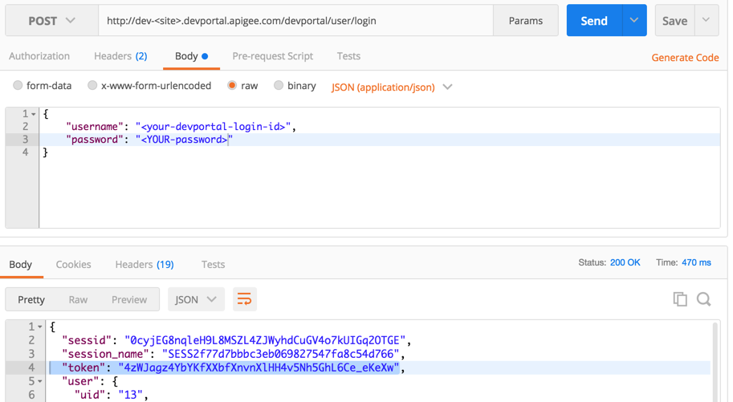

    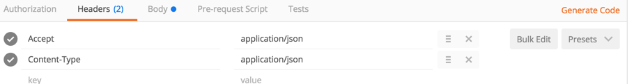

1. Run the request.

1. Note the token value similar to:

    "token": "4zWJagz4YbYKfXXbfXnvnXlHH4v5Nh5GhL6Ce_eKeXw"

### Execute import Request of the SmartDocs Service module for a Swagger yaml Specification

1. In the Postman, create a new request for importing swagger yaml file. 

    Use [banking.yaml](banking.yaml) file from the docs folder of the smartdocs-service project.

	    Verb: POST

	    URL: http://dev-<site>.devportal.apigee.com/devportal/smartdocs/import

	    Body: form-data

	Body parameters

		model	Type: Text 	Value: banking

		files[swagger]	Type: File	Value: banking.yaml 

		type	Type: Text	Value: yaml

	Header: X-CSRF-Token

	Header Value: 4zWJagz4YbYKfXXbfXnvnXlHH4v5Nh5GhL6Ce_eKeXw

    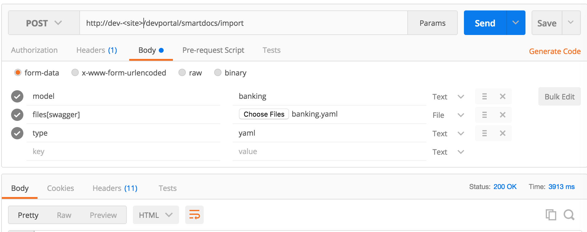

    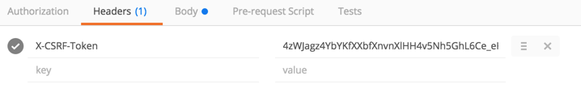

1. Execute the request.

    The result should be Status: 200

### Verifying Result of the Request in DevPortal

1. Go to Content/SmartDocs. 

    The banking line will show 1 Rendered Node, 1 Published Node.

    

1. Open Banking model.

    The API Revision #1 will be displayed.

    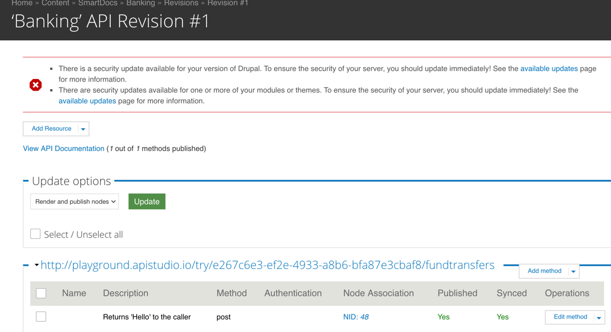

1. Click on Home Menu item. The new API resource transactions of /fundtransfers endpoint will be displayed.

    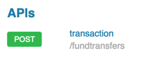

1. Click on the transaction link. 

    The rendered SmartDocs will be displayed.

    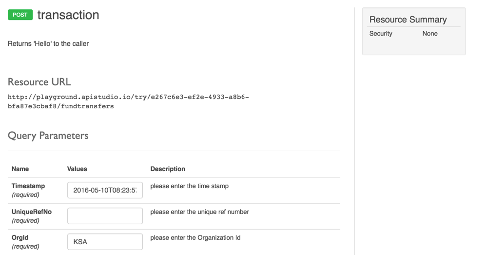

## Importing, Rendering, and Publishing swagger json specification

1. Create model petstore.

1. In the Postman, create a new request for importing swagger json file. 

    Use [petstore.json](petstore.json) file from the docs folder of the smartdocs-service project.

	    Verb: POST

	    URL: http://dev-<site>.devportal.apigee.com/devportal/smartdocs/import

	    Body: form-data

	Body parameters

		model	Type: Text 	Value: banking

		files[swagger]	Type: File	Value: petstore.json 

		type	Type: Text	Value: json

	Header: X-CSRF-Token

	Header Value: 4zWJagz4YbYKfXXbfXnvnXlHH4v5Nh5GhL6Ce_eKeXw

    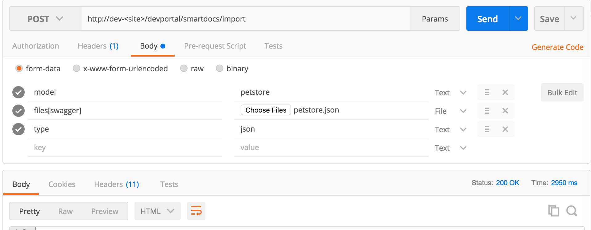

1. Execute the request.

    The result should be Status: 200

    Three new nodes will be rendered and published on petstore model.

    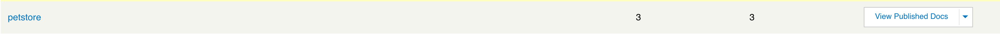

    The #1st revision of the petstore now contains three method definitions.

    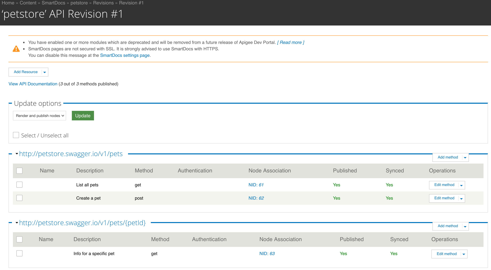


## Curl call to the SmartDocs Services Module

CI/CD is an important use case to use this module while working with Apigee DevPortal.

Usually, you put your OpenAPI specifications [former swagger] under VCS control next to the proxies they describe. Then a Jenkins job will be triggered by a commit and your sh script would publish latest version of the spec as a new SmartDocs revision. 

Here is a curl command you can use to implement this publishing step.

```
curl -X POST \
    -H "Accept: application/json" \
    -H "Content-Type: application/json" \
    -d "{ \
        \"username\": \"<devportal-user-id>\", \
        \"password\": \"<her-password>\" \
    }" \
    "http://<your-drupal-site>/devportal/user/login"
```

The response will begin with:
```
{"sessid":"Opw4RXkzY-Ni5oHZpZW3j5K_jnHzbT3CzessDmh_-I0","session_name":"SESSa50ebb77519f2a0f5cc535f9f549be74","token":"CZq25s_qxvXwI4i93ICNzZSTSuAz-0x3LeV31FgFsaU","user":{...
```
Take a note on sessionid and session_name values, as we need them to set up a Cookie header value, in addition to the X-CSRF-Token header:

```
curl -X POST \
    -H "Cookie: **SESSa50ebb77519f2a0f5cc535f9f549be74**=**Opw4RXkzY-Ni5oHZpZW3j5K_jnHzbT3CzessDmh_-I0**" \
    -H "X-CSRF-Token: C**Zq25s_qxvXwI4i93ICNzZSTSuAz-0x3LeV31FgFsaU**" \
    -F "model=model8" \
    -F "files[swagger]=@banking.yaml" \
    -F "field_name=field" \
    "[http://<your-drupal-site>/devportal/smartdocs/import](http://192.168.56.102/devportal/smartdocs/import)"
```

### Developer's Bonus Point. 

While investing problems, it is useful to know that in a defaut installaton, the file we've processed can be retrieved at http://dev-<site>.devportal.apigee.com/sites/default/files/banking.yaml

### Developer's Bonus Point. 

Go to Reports/Recent log messages.

You will see diagnostic messages, logged by watchdog() statements.

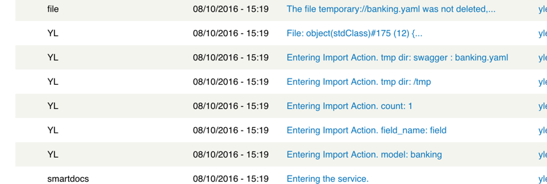

## Uninstall/Reverse Changes

1. Modules

    switch off in this order

    * smartdocs services

    * rest server

    * services

1. code remove smartdocs modules; commit; push

1. Delete banking model Content/SmartDocs

1. Clear log messages

